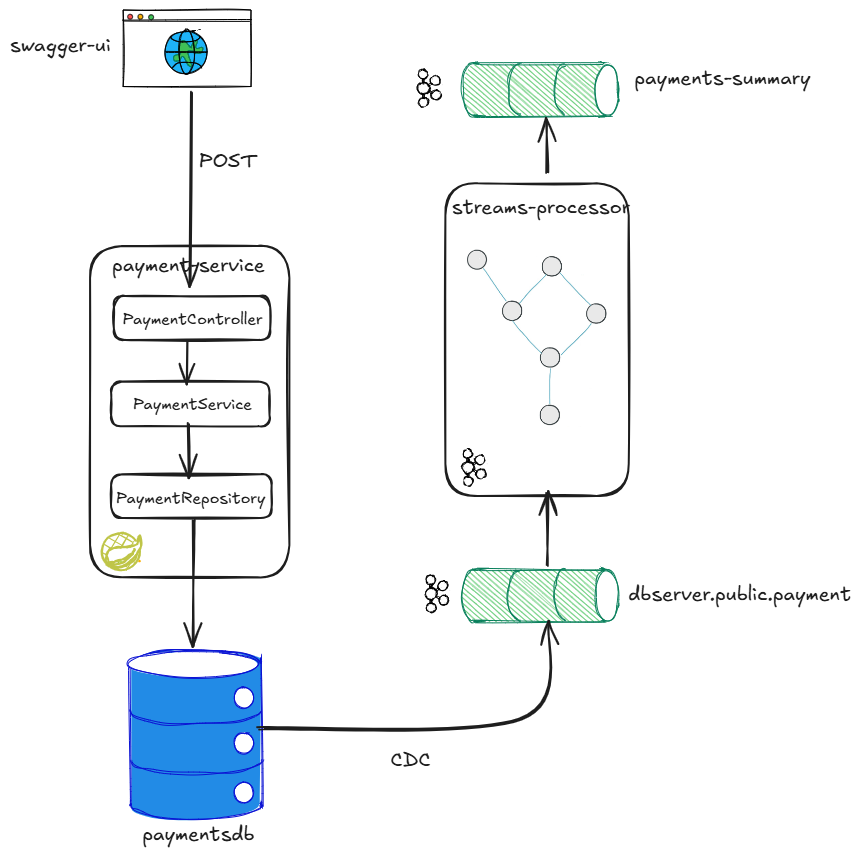

# Payment Pipeline Demo

This project demonstrates an **event-driven payment processing pipeline** built with **Kafka**, **PostgreSQL**, and **Kafka Streams**, using **Change Data Capture (CDC)** to propagate database changes as events.

It shows how a traditional **CRUD-based payment API** can be integrated into a **streaming architecture** suitable for real-time processing, analytics, and downstream consumers.

---

## Architecture Overview

**Flow:**

1. A REST API handles **debit / credit payment operations**
2. Payments are persisted in **PostgreSQL**
3. **Kafka Connect (Debezium)** captures database changes
4. Changes are published to **Kafka topics**
5. A **Kafka Streams topology** processes payment events in real time

This mirrors real-world payment systems where the database remains the source of truth, while Kafka enables scalable event-driven processing.


---

## Tech Stack

- **Java / Spring Boot** – Payment API
- **PostgreSQL** – Payment persistence
- **Apache Kafka** – Event backbone
- **Kafka Connect (Debezium)** – CDC from Postgres
- **Kafka Streams** – Stream processing
- **Docker & Docker Compose** – Local infrastructure

---

## Services (Docker Compose)

The project uses Docker Compose to run the full stack locally:

- Kafka
- Zookeeper
- PostgreSQL
- Kafka Connect (with Debezium)

All services are defined in `docker-compose.yml`.

---

## Getting Started

### Prerequisites

- Docker & Docker Compose
- Java 17+ (or the version used by the project)
- Maven

---

### Start Infrastructure

```bash
docker-compose up -d
```

This will start:

- Kafka
- Zookeeper
- PostgreSQL
- Kafka Connect (Debezium)

You can check logs to confirm all services are up:

```bash
docker-compose logs -f
```

### Start the Payment API

Build and run the Spring Boot API:

```bash
mvn clean spring-boot:run
```

The API will start on:

```bash
http://localhost:8080
```

## Payment API

The Payment API exposes endpoints for **debit and credit operations**.

### Swagger / OpenAPI

The API is documented using **Swagger** and can be tested interactively.

Once the application is running, open:

```bash
http://localhost:8080/swagger-ui.html
```

From Swagger UI you can:

- Create debit / credit payments
- Inspect request and response payloads
- Validate API behavior without external tools

### Example Request

```http
POST /payments
Content-Type: application/json
{
  "accountId": "123",
  "amount": 100,
  "type": "DEBIT"
}
```
Payments are:
- Written to PostgreSQL
- Captured automatically by CDC
- Published to Kafka topics

### CDC (Change Data Capture)
- Implemented using Kafka Connect + Debezium
- Captures inserts and updates on the payments table
- Publishes events to Kafka automatically, without the API writing directly to Kafka

This ensures the database remains the source of truth, avoiding dual-write issues.

### Kafka Streams
A Kafka Streams topology processes payment events to:
- Transform
- Aggregate
- Enrich
- Prepare data for downstream consumers

The exact logic depends on the implementation and demonstrates real-time stream processing for payment events.